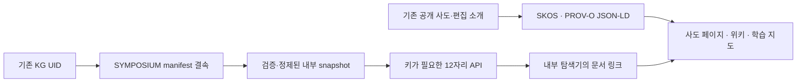

# 12사도: KG → ontology API → 공개 웹

이 연결은 기존 KG 결속을 가진 SYMPOSIUM projection을 재사용한다. 12개 자리는
내부 ontology의 식별자로, 공개 설명은 기존 학습 지도의 개념 IRI로, 웹 문서는
문서 IRI로 구분한다. 새 사도·정전 판정·Neo4j 관계를 만들지 않는다.

## 출처와 소유 범위

- KG 결속과 충돌 정책의 소유자: SYMPOSIUM의
  `METAHUMOTONIC/ontology/metahumotonic-public-graph.v1.json` 및 `PROVENANCE.md`.
  `stable_ref`는 그 소유자의 내부 KG UID이며 공개 문서에 복제하지 않는다.
- 백엔드: 검증된 browser DTO를 읽는 `app/ontology.py`와
  [`app/ontology_web.py`](../app/ontology_web.py)의 명시적 웹 경로 대응표.
- 프런트엔드: `metahumotonic-web`의 기존 `src/data/apostles.json`,
  `apostle-introductions.json`, `src/lib/public-content.ts`. 새 RDF는 이 공개
  투영의 이름·편집 소개·문서 URL만 사용한다.
- 공개 그래프: `/apostles/graph.jsonld`. 내부 API: `/api/v1/ontology/apostles`.
  각각 공개 편집 데이터와 `INTERNAL_ONLY` 데이터를 제공한다.

## 식별자와 관계 계약

| 대상 | 식별자 | 의미 |
|---|---|---|
| 내부 자리 | 기존 opaque `public_id` | manifest가 고정한 자리. 문자열에서 번호를 추론하지 않는다. |
| 공개 편집 개념 | `https://metahumotonic.com/learn/#entity-apostle-N` | 기존 학습 지도와 같은 공개 개념. KG UID가 아니다. |
| 사도 문서 | `https://metahumotonic.com/apostles/SLUG/#page` | 개념을 설명하는 문서 |
| 위키 문서 | `https://metahumotonic.com/wiki/apostles/SLUG/#page` | 공개 미러 문서 |

공개 RDF의 어휘와 방향은 다음과 같다. 이것들은 웹 투영의 관계이며 Neo4j의
등록된 predicate를 대체하거나 자동 생성하지 않는다.

| 관계 | domain → range | 카디널리티·검증 의미 |
|---|---|---|
| `skos:memberList` | OrderedCollection → RDF list of Concept | 정확히 12개, 순서·중복 검사 |
| `skos:inScheme` | Concept → ConceptScheme | 개념마다 1개 |
| `skos:hasTopConcept` | ConceptScheme → Concept | scheme에 12개 |
| `schema:subjectOf` | Concept → WebPage | 개념마다 사도·위키 문서 2개 |
| `schema:about`, `schema:mainEntity` | WebPage → Concept | 문서마다 동일한 개념 1개 |
| `prov:wasDerivedFrom` | 공개 Entity → 출처 Entity | 공개 데이터 또는 해당 위키 문서. 각 endpoint 존재 검사 |

`owl:sameAs`, `skos:exactMatch`, 이름 유사도를 통한 KG 병합을 사용하지 않는다.
공개 그래프의 `schema:version`은 allowlist로 추린 공개 행을
`JSON.stringify`한 UTF-8 바이트의 SHA-256이다. 원본 파일 전체의 digest나 RDF
canonicalization digest라는 주장은 아니다. 내부 응답에는 기존 snapshot의
`content_sha256`와 release metadata가 유지된다.

## 9번 자리와 본문 권위

9번은 기존 manifest의 `CONFLICT_PENDING`을 유지한다. 공개판의 예수 문서를
링크해도 내부 `entity`는 `null`이고 두 후보의 `default_servable`는 `false`다.
웹 연결 상태는 `CONFLICT_REFERENCE_ONLY`다. 공개 개념에는 그 범위를 설명하는
`skos:scopeNote`가 있으며 위키 화면에도 같은 주의를 표시한다.

2026-09-29 KG 조회에서는 오래된 12사도 WorldSetting의 아텐 표기와 예수/아텐의
의도된 구별을 설명하는 후속 기록이 함께 발견되었다. 후속 설명만으로는 이
projection이 요구하는 exact binding·사용자 supersession 근거를 충족했다고
판정하지 않았다. 조회에서 반환된 `UNSPECIFIED` 관계 상태도 `ACTIVE`로 바꾸지 않았다.

깊바존·몬순의 내부 `content_authority`와 `body_policy` 역시 그대로 반환한다.
웹 편집 소개가 내부 원문의 권위를 승격하지 않는다. 공허진동자를 별도의
13번째 사도로 만들지 않으며 사도↔도구의 새로운 1:1 대응도 추가하지 않는다.

## 검증과 운영

백엔드에서 `uv run --extra dev pytest -q`, 프런트엔드에서
`./scripts/with-node.sh npm run build` 후 `./scripts/with-node.sh npm run test:release`.
프런트엔드 release gate에는 실제 RDFLib 파싱과 pySHACL 검증이 포함된다.
shape는 `docs/graph/apostles.shacl.ttl`, 검증기는
`scripts/verify/apostle_graph.py`이며 고정된 Python 의존성을 `uv`로 실행한다.
CI에서는 release 검사 전에 `uv`를 설치한다.

검증 질문은 “각 사도에서 올바른 두 문서와 출처에 도달하는가”, “위키와
학습 지도가 같은 공개 개념을 가리키는가”, “9번 문서 링크가 선택을 만들지
않는가”, “잘못된 권위·동일성·endpoint·중복을 거부하는가”다.

2026-09-29에는 실제 SYMPOSIUM manifest의 source hash 검증 후 sanitizer →
백엔드 loader → 웹 대응표까지 12개 모두 대조했다. 이는 당시 로컬 검증이며
배포나 현재 KG 운영 상태의 증거가 아니다.

2026-09-30 완료 확인: 백엔드 전체 307 passed / 9 skipped, 프런트엔드 release
검사 통과, 공개 RDF 316 triple의 SHACL 검증 및 네 가지 잘못된 변형 거부,
45개 기존 파일 drift 검사와 build-trace gate 통과. 로컬 fixture를 사용한
실제 Chromium에서 OMC 문서 연결, 9번의 두 미결 후보, 모바일 표시, 문서
이동 시 내부 키·referrer 미전달을 확인했다. 이 브라우저 검증은 운영 서버
접속 결과가 아니다.

배포 시에는 백엔드의 새 directory endpoint를 먼저 제공한 뒤 프런트엔드를
갱신한다. 새 탐색기는 해당 endpoint가 없거나 release가 다르면 연결을
중단한다. ontology ingress와 snapshot의 공개 범위는 계속 `INTERNAL_ONLY`다.
기존 공개 데이터의 JSON-LD에만 Nginx MIME 경로를 추가했다.

이 변경은 Neo4j에 새 관계를 기록하지 않았다. 공유 ontology 조회 4-tool과
이 저장소의 snapshot reader에는 승인된 KG publisher가 없다. 원본 KG에 웹
관계의 영속화까지 필요하면 SYMPOSIUM 소유자가 이 명시적 대응표를 변경안으로
삼아 기존 writer의 predicate·권한·transaction·readback 계약을 적용해야 한다.
그 경우에도 9번을 자동 선택하거나 기존 membership을 삭제하면 안 된다.

참조: [SKOS](https://www.w3.org/TR/skos-reference/),
[PROV-O](https://www.w3.org/TR/prov-o/), [SHACL](https://www.w3.org/TR/shacl/).
