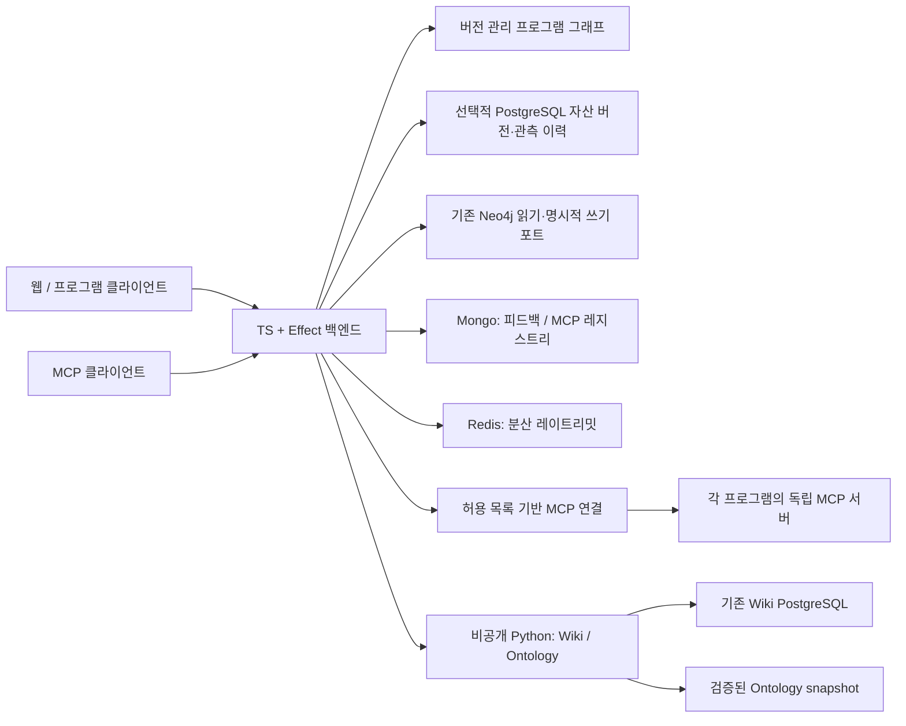

# 웹사이트 백엔드와 회사 연결 기능 — TS / Effect

**우선 역할은 MetaHumotonic 대표 웹사이트를 지원하는 것이다.** 회사 공통 그래프·MCP는
추가 연결 기능이다. [웹백의 역할](WEB_BACKEND_ROLE.md)에 방문 경험과 기능의 관계,
현재 구현과 후속 도입 기준을 정리했다.

기본 `Dockerfile`과 Compose의 공개 진입점은 TypeScript / Effect다. 기존 웹 API,
프로그램 그래프, MCP 레지스트리와 MCP 게이트웨이를 같은 composition에서 제공한다.
이 문서는 **구현된 배포 후보**를 설명한다. 기존 VM100 운영 인스턴스의 전환 완료를
주장하지 않는다.

현재 조사 범위를 반영한 카탈로그는 **프로그램 40개를 포함한 197개 자산·197개 관계·
109개 시점 관측**이다. 저장소·MCP·서버·실제 배포를 연결하며, 수용 범위와 PostgreSQL·
관측·인증의 도입 순서는 [회사 플랫폼 설계](COMPANY_PLATFORM_ARCHITECTURE.md)를 따른다.



## 소유 경계

- `domain/`: 순수 스키마·그래프 검증·관계 투영. I/O 없이 시험한다.
- `ports/`: Mongo, Redis, Neo4j, 기존 도메인 서비스와 MCP 연결을 Effect로 감싼다.
  연결은 Layer scope가 닫는다. 실패는 typed error로 반환한다.
- `server/Composition.ts`: 실제 서버와 HTTP 테스트가 공유하는 유일한 조립 지점.
- Wiki의 event/revision/CAS/idempotency, PostgreSQL migration과 ontology snapshot
  검증은 기존 Python 도메인이 계속 소유한다. TS는 허용된 경로만 전달한다.
- HSWM·USL·HSPINE·제품 서버는 각 저장소/실행기의 데이터와 권한을 소유한다.
  공통 백엔드는 등록·조회·접근 경계를 제공한다. 코드를 이 저장소에 복제하지 않았다.

**Python 제거까지 완료한 전면 재작성은 아니다.** Wiki·ontology·기존 CLI는 Python에
남아 있다. 독립 서비스 경계를 유지한 채 공통 진입점을 TS로 옮겼다.

## API

| 경로 | 접근 | 기능 |
|---|---|---|
| 기존 `/api/stats`, `/api/domains`, `/api/skills`, `/api/research/*` | 기존 정책 | TS KG 서비스 |
| `/api/feedback`, `/internal/feedback/*` | 기존 정책 | TS Mongo 저장·CAS triage·삭제 |
| `/api/mcp`, `/api/mcp/{servers,manifest,health,status,vault}` | 공개 읽기 | 기존 Mongo 문서와 호환되는 TS 레지스트리 |
| `/.well-known/mcp-servers.json` | 공개 | manifest로 302 |
| `/api/platform/v1/programs` | 플랫폼 읽기/쓰기 키 | 근거가 연결된 프로그램 목록 |
| `/api/platform/v1/inventory`, `/inventory/:id` | 플랫폼 읽기/쓰기 키 | 이름·별칭·종류·분류·소유 저장소 검색, 페이지네이션, 최신 관측과 만료 표시 |
| `/api/platform/v1/summary` | 플랫폼 읽기/쓰기 키 | 자산 분포, 관측 신선도, 소유권·관측 누락 |
| `POST /api/platform/v1/observations` | 플랫폼 쓰기 키 | PostgreSQL 관측 batch 저장·재전송 중복 제거 |
| `GET /api/platform/v1/observations`, `/api/platform/v1/receipts/:id` | 플랫폼 읽기/쓰기 키 | 관측 이력·cursor·저장 영수증 |
| `/api/platform/v1/graph` | 플랫폼 읽기/쓰기 키 | 전체 카탈로그 snapshot과 digest |
| `/api/platform/v1/graph/export` | 플랫폼 읽기/쓰기 키 | USL `property-graph/v2` 입력 형태 |
| `/api/platform/v1/graph/jsonld` | 플랫폼 읽기/쓰기 키 | JSON-LD 1.1 / RDF / PROV-O 내부 dataset |
| `/api/platform/v1/neighbors?id=...&limit=25` | 플랫폼 읽기/쓰기 키 | 최대 100개 관계, 기본 ACTIVE만 |
| `/api/platform/v1/services` | 플랫폼 읽기/쓰기 키 | 인프라 목록과 MCP 연결 설정 상태 |
| `/api/platform/v1/mcp/:id/tools` | 플랫폼 읽기/쓰기 키 | 실제 upstream의 허용된 도구 목록 |
| `/api/platform/v1/mcp/:id/call` | 도구별 키 권한 | 명시적으로 허용된 upstream 호출 |
| `/mcp` | 플랫폼 읽기/쓰기 키 | Streamable HTTP MCP |
| `/api/wiki/v1/*`, `/internal/wiki/moderation/*`, `/api/v1/ontology/*` | 기존 도메인 인증 | 고정된 비공개 도메인 서비스에 전달 |
| `/health`, `/ready`, `/metrics` | 내부 운영 경로 | liveness, 의존성 readiness, TS 요청 카운터 |

`/mcp`에는 `platform_programs`, `platform_graph`, `platform_services`,
`platform_tools`, `platform_call`, `platform_learning`, `platform_inventory`,
`platform_summary`, `platform_export`, `platform_reality`, `platform_observations`가 있다. JSON 응답의 stateless transport이며 GET SSE
구독은 제공하지 않는다. MCP 클라이언트는 `Authorization: Bearer ...`를 사용한다.
REST는 `X-API-Key`도 받는다. OAuth 로그인 서버를 구현한 것은 아니다.

회사 자산 정의의 버전과 관측 이력을 저장하는 선택적 TS PostgreSQL 포트를 추가했다.
`MHB_PLATFORM_DATABASE_URL`이 설정되면 필수 의존성으로 처리하고, 서버 시작 시 DDL이나
자동 import를 하지 않는다. 설정·권한·실DB 검증은 [PostgreSQL 저장소 문서](PLATFORM_POSTGRES.md)를 따른다.

## 그래프 엔지니어링

구현과 실제 운영을 구분하는 [백엔드 현실 판정 그래프](BACKEND_REALITY_GRAPH.md)는
20개 구성요소·13개 방향 관계에 근거와 만료 시각을 붙인다. 내부 API의
`/api/platform/v1/reality`·`/reality/export`·`/reality/jsonld`로 같은 판정을 읽는다.
MCP의 `platform_reality` 도구도 같은 출처를 사용한다.
2026-09-28 운영 확인에서 공개 API는 여전히 Python이고 TS는 배포 후보였다.

공개 철학·프로그램·GitHub·YouTube를 연결하는 `/api/public/v1/hub`와 웹 학습 허브는
[LEARNING_HUB.md](LEARNING_HUB.md)에 별도로 설명한다. 내부 프로그램 그래프를 공개하지 않는다.

기준으로 읽은 로컬 문서는 SYMPOSIUM의
`THEORY/GRAPH_ENGINEERING/PROJECT_GRAPH_ENGINEERING_BASELINE.md`다. 이 기준의 핵심은
상태·데이터·effect·provenance 소유권을 구분하는 것이다. GEIP GraphSpec은 로컬 초안이며
구조 검증을 실행 적합성이나 운영 준비 완료로 해석하지 않는다.

카탈로그는 [`ts/config/platform-catalog.json`](../ts/config/platform-catalog.json),
런타임 검증은 [`PlatformGraph.ts`](../ts/src/domain/PlatformGraph.ts)에 있다.
stable ID 중복, dangling edge, ACTIVE `DEPENDS_ON` cycle을 거부한다. 의미 관계의
cycle은 실행 의존성 cycle과 별개다. PROPOSED/RETIRED/UNSPECIFIED를 ACTIVE로
승격하지 않는다. USL export도 방향, 관계 종류, 상태와 근거를 보존한다.

로컬 USL의 실제 어댑터로 현재 197개 노드·197개 관계의 변환도 검사했다.
[최신 검증 영수증](evidence/usl-company-inventory-2026-09-27.json)은 source digest와
사용한 어댑터 파일 해시를 담는다. 재실행은 빌드 후
`cd ts && bash scripts/with-node.sh node scripts/check-usl-interop.mjs /path/to/USL`로 한다.
초기 43개 노드의 [검증 기록](evidence/usl-platform-interop-2026-09-27.json)은 당시 상태로 보존한다.
현재 RDF projection은 별도 RDFLib/pySHACL 검사도 통과했으며 CI에서 재검증한다.

카탈로그의 관계는 실행 명령이나 허가가 아니다. 별도의
[`mcp-bindings.json`](../ts/config/mcp-bindings.json)이 서버 ID·환경변수 참조·허용
도구·읽기/쓰기 범위를 고정한다. KG나 HTTP 요청에서 URL·토큰·Cypher·파일 경로를
가져와 자동 실행하지 않는다. GraphSpec D1–D4 인증이나 범용 durable workflow
engine을 주장하지 않는다. 제어 경계는 [`engineering/control-card.json`](../engineering/control-card.json)에 기록했다.

## KG 조사 결과

사용자가 강조한 버엑시·수풀림·메이플리니지·USL·HSWM과 PostgreSQL의 보완된
역할·소유권은 [PROGRAM_PORTFOLIO.md](PROGRAM_PORTFOLIO.md)에 정리했다.
아래의 초기 조사에 메이플리니지를 추가하고 버엑시·수풀림의 KG 근거를 보강했다.

2026-09-26~27에 비밀 아닌 ontology 기록을 조회하고, 로컬 저장소의 실제 HEAD를
함께 확인했다. 아래의 “우선 연결”은 이번 백엔드 작업의 엔지니어링 판단이다.
KG에서 회사 전체 중요도 순위를 조회한 것처럼 취급하지 않는다.

| 우선 연결 | 확인 근거와 의미 |
|---|---|
| HSWM | USER_PRIMARY 개념과 별도 저장소. 지속적 token-native world model이라는 목표 정체성과 실증 효능은 구분 |
| USL | USER_PRIMARY 개념, ACTIVE `EXTENDS → HSWM`, 현재 TS/Effect 구현과 `property-graph/v2` 어댑터 확인 |
| HSPINE | 실제 저장소와 2026-09-08 MCP 커넥터 기록. 사람 GUI 권한과 에이전트 채널의 구분을 유지 |
| MCP Connectors | 데이터·운영·기억·HSPINE 네 표면의 KG 기록. 접속 capability URL은 카탈로그에 저장하지 않음 |
| Graph Engineering | GraphSpec/검증기/도입 기준의 실제 파일 확인. KG의 CD/19 카드는 SECONDARY_AI 설명이며 실행 인증이 아님 |
| bhgman_tool / Agent Coding Paradigm | KG의 관련 검증·교훈·계획 기록과 저장소. 관련 기록을 프로그램 자체의 동일성으로 오인하지 않음 |
| ICE ORCA DRAGON | 현재 README의 TS/Effect 제어면, HSWM·USL 통합 확인. KG의 동명 서사 캐릭터와 프로그램을 동일시하지 않음 |
| 수풀림·버엑시 | 실제 저장소 HEAD와 KG의 사용자 명명/시스템 지도 확인. 수풀림은 기본 SQLite와 선택적 PostgreSQL 어댑터를 구분 |
| 메이플리니지 | 독립 MAPLELINEAGE 저장소, PostgreSQL 개발 DB 연결 기록, 읽기 전용 개발 MCP 확인. 회사 MCP 연결은 아직 PROPOSED |
| MIND·333 | 실제 저장소 HEAD를 연결 후보로 기록. 제한된 이름 검색만으로 KG에 없다고 단정하지 않음 |

HOH 방송 플랫폼 개념도 조회했다. 해당 기록은 “계획된 플랫폼, 구현·기술·배포 주장
없음”이라고 명시한다. 이를 이미 실행 중인 서버로 등록하지 않았다.

데이터 서비스 위치 기록과 ACTIVE 이웃에서 Neo4j, MongoDB, Redis, PostgreSQL,
LakatoTree PostgreSQL, MinIO, Qdrant, Kafka, TypeDB, airo KG를 확인했다. **기록 조회는
현재 가동 상태 검증과 다르다.** 주요 기록의 마지막 버전은 2026-09-07~08이다.

정확한 UID·authority·record revision·텍스트 해시·관계 상태는
[`company-kg-observations-2026-09-27.json`](evidence/company-kg-observations-2026-09-27.json),
로컬 HEAD와 관측 시간은 카탈로그의 `evidence`에 보존했다.

## 실행과 연결

```sh
cp .env.example .env
# .env에 서로 다른 MHB_PLATFORM_READ_KEY / MHB_PLATFORM_WRITE_KEY를 설정한다.
# 기존 Mongo/Redis/KG/Wiki/ontology 변수는 각 소유 서비스의 설정을 사용한다.
docker compose up --build
```

기본 바인딩은 `127.0.0.1:8000`이고 Python 도메인은 외부 포트를 publish하지 않는다.
기존 VM100 replica를 이 명령으로 덮어쓰지 않는다. VM100의 기존 Python release
스크립트는 `Dockerfile.legacy`를 명시하므로 기존 절차가 다른 런타임을 갑자기 배포하지 않는다.

TS만 실행할 때:

```sh
cd ts
bash scripts/with-node.sh npm ci
bash scripts/with-node.sh npm run dev
```

기존 Python 서비스에 연결하려면 `MHB_LEGACY_ORIGIN=http://<private-host>:<port>`와
`MHB_LEGACY_REQUIRED=true`를 설정한다. URL에는 credentials/path/query를 넣지 않는다.
서버가 없으면 해당 도메인 요청은 503이고, required이면 `/ready`도 503이다.
Wiki 세션 쿠키·CSRF·Origin·Idempotency-Key·ETag·응답 상태를 그대로 보존한다.

기본 MCP 연결은 ontology와 HSPINE capabilities를 등록하되, URL 환경변수가 없으면
`configured=false`다. `MHB_ONTOLOGY_MCP_URL`, `MHB_HSPINE_MCP_URL`과 필요한 토큰을
런타임 secret으로 넣는다. 다른 MCP는 카탈로그에 `mcp-server` 노드를 등록하고
binding을 추가한다. 사용자 지정 파일은 `MHB_MCP_BINDINGS`로 선택하고 컨테이너에
read-only mount한다. 원격 연결은 Streamable HTTP를 사용하며 stdio 프로세스를
임의 생성하지 않는다. 기존 stdio 서버는 소유 서비스의 HTTP bridge가 필요하다.

메이플리니지 개발 MCP도 세 읽기 도구만 등록했다. 주소·토큰은
`MHB_MAPLELINEAGE_MCP_URL` / `MHB_MAPLELINEAGE_MCP_TOKEN`이며 기본값은 미설정이다.

호출에는 10초 deadline, 요청 512 KiB, upstream 응답 1 MiB, tools/list 4페이지 한도가
있다. 자동 재시도하지 않는다. 실패 후 쓰기 결과가 불명확하면 upstream 소유자의
idempotency/readback 절차를 사용한다. 범용 outbox/작업 재개는 제공하지 않는다.

Mongo 설정이 있으면 피드백은 실제 acknowledged write에만 `stored`를 반환한다.
Mongo가 없으면 기존 개발용 memory mode이며 durable 필수 설정에서는 503이다.
설정된 Mongo의 실패를 memory 성공으로 바꾸지 않는다. TTL이 기존 인덱스와 다르면
startup에서 자동 삭제하지 않으며 운영 migration으로 맞춰야 한다.

## 검증 및 운영 전환

```sh
bash ts/scripts/with-node.sh npm --prefix ts run typecheck
bash ts/scripts/with-node.sh npm --prefix ts test
bash ts/scripts/with-node.sh npm --prefix ts run smoke
python3 scripts/check-platform-local.py  # 실제 Python 도메인 + compiled TS, loopback
# 로컬 임시 MongoDB(자동 다운로드) + 설치된 redis-server. 운영 DB를 사용하지 않는다.
cd ts && bash scripts/with-node.sh npm run test:persistence
```

일반 테스트는 외부 DB 검증 5개를 skip한다. `test:persistence` 또는 CI의 임시
Mongo/Redis job이 이를 실제 DB로 실행한다. Mongo는 다른 클라이언트로 readback,
runtime 재생성 후 재조회, 동시 CAS, 연락처 삭제와 저장 실패를 검사한다. Redis는
Python 형식의 기존 window를 TS runtime 두 개가 공유하는 동시 요청과 runtime 재생성
후 제한 유지를 검사한다. 실제 소켓 검사는 운영 ID 생성기로 피드백 생성·검토·삭제까지 확인한다.

기존 운영의 트래픽 전환은 별도 단계다. 실제 endpoint/token 주입, 두 서비스의
container image build, 현재 Wiki/ontology 설정으로 `/ready`, 공개/내부 route 경계와
CLI/MCP readback을 확인한 뒤 기존 VM100 rollout 절차에 맞춰 전환해야 한다.
이 변경만으로 운영 트래픽이나 원격 서버의 실행 위치를 변경하지 않는다.

MCP 구현 참고: [공식 TypeScript SDK](https://ts.sdk.modelcontextprotocol.io/server).

## 2단계: 실제 MCP와 네이티브 저장소 readiness

2026-09-27에 임시 loopback TS 진입점을 실행하고 실제 Ontology MCP의 비밀 아닌
`sym:Concept:hswm` 레코드와 HSPINE HTTP MCP의 capabilities를 읽었다. 공식 SDK의
직접 응답, 회사 REST 경유 응답, 회사 MCP `platform_call` 경유 응답을 각각 읽어
정규화한 결과 해시가 동일한지 비교했다. 두 서비스 모두 통과했다.

- [2단계 실행 시점의 MCP 검증 기록](evidence/company-mcp-phase-2-readback-2026-09-27-r3.json)은 전체 compiled tree digest와 서버별 결과 해시를 담는다. 주소·토큰·레코드 본문은 저장하지 않는다.
- HSPINE 관측 경계는 `mode=unified`, `executionEnabled=false`다. 이번 검증은 capabilities 읽기이며 개인 GUI 실행 권한이나 메시지 작성 권한을 위임하지 않는다.
- 최초 실패 기록도 보존한다. HSPINE의 공개 capabilities에 로컬 전용 `policy_version`을 요구했던 검증기의 가정이 원인이었다. 실제 공통 응답 계약과 관측된 실행 경계를 검사하도록 수정했다.
- 이 실행은 새 백엔드 프로세스의 연결 검증이다. 운영 `.env`, MCP 소유 서비스 설정, ingress는 변경하지 않았다.

재현에는 운영자가 선택한 HTTP MCP 주소를 환경변수로 명시한다. 스크립트는 Codex
설정이나 credential 파일을 자동 검색하지 않으며, 호출 도구와 인자는 두 읽기 probe로
고정되어 있다. 기존 기록은 덮어쓰지 않는다.

```sh
bash ts/scripts/with-node.sh npm --prefix ts run build
# MHB_ONTOLOGY_MCP_URL, MHB_HSPINE_MCP_URL 및 필요한 TOKEN 환경변수 설정 후:
bash ts/scripts/with-node.sh node ts/scripts/check-mcp-readback.mjs /path/to/new-receipt.json
```

`/ready`는 이제 실제 Mongo/Redis 연결을 읽는다. `mongo_required`, `mongo_live`,
`redis_required`, `redis_live`를 기존 응답에 추가했다. Mongo가 설정되어 있거나
durable feedback이 필수이면 Mongo 응답 실패에 503을 반환한다. 설정된 Redis가
응답하지 않아도 503이다. 프로세스 `/health`와 공개 학습 자료는 별도로 제공한다.
두 저장소를 설정하지 않은 명시적인 로컬 개발 구성은 계속 허용한다. readiness는
인덱스를 변경하거나 저장소에 데이터를 쓰지 않는다.

실제 임시 Mongo/Redis의 HTTP readiness를 포함한 persistence 5개 테스트와
연결 실패·durable 설정 누락에 대한 회귀 검사를 통과했다.

컴파일된 실제 TS 프로세스에서도 직접 만든 Mongo를 중지/재시작하고 Redis를
SIGSTOP/SIGCONT로 멈추고 재개했다. 정상 200 → Mongo 장애 503 → 복구 200 →
Redis 무응답 503 → 복구 200을 확인했고 모든 단계에서 프로세스 liveness는 유지됐다.
검사 후 소유한 프로세스와 임시 경로를 정리했다.
[실제 장애·복구 기록](evidence/company-native-runtime-phase-2-2026-09-27.json)은 검사 코드와
readiness 구현 해시를 포함한다. 이는 컨테이너/운영 DB 실측과 별개다.

```sh
# TS 빌드 후, 로컬 redis-server가 필요하다. 별도 바이너리는 MHB_TEST_REDIS_BINARY로 지정.
cd ts
bash scripts/with-node.sh node scripts/check-native-runtime.mjs /path/to/new-native-receipt.json
```

## 컨테이너 통합 게이트

기존 CI의 이미지 빌드만 하는 검사를 `platform-containers` job으로 확장했다.
`scripts/check-platform-containers.py`는 실제 Dockerfile 두 개를 빌드하고 임시
Mongo·Redis·Python 도메인·TS 복제본 두 개를 내부 네트워크에 띄운다. 복제본에만
임시 loopback 포트를 열고, 각 컨테이너에 메모리/CPU/PID 상한을 건다.

검사는 실제 이미지 ID, 비-root TS 실행, Docker healthcheck, Python 원본과 Wiki 응답
동일성, 공개 그래프, 인증, MCP initialize, Mongo 독립 readback, Redis 독립 readback,
복제본 간 제한 공유, 재시작 후 보존, 저장소 장애 시 readiness와 복구를 포함한다.
소유 nonce가 일치하는 자원만 정리하고 삭제 결과를 다시 확인한 뒤 PASS를 쓴다.
production env를 읽지 않으며 원격 Docker context도 거부한다. SIGKILL이나 호스트
중단은 자동 정리 완료로 취급할 수 없으므로 receipt nonce의 label을 확인해 복구해야 한다.

```sh
# Docker가 있는 별도 통합 worker 또는 CI에서 실행. VM100 운영 호스트에서는 실행하지 않는다.
python3 scripts/check-platform-containers.py --receipt /path/to/new-container-receipt.json
```

현재 dev-01에는 Docker/Podman이 없고 rootless UID-map 도구와 passwordless sudo도
없다. 따라서 **컨테이너 실측은 NOT_RUN**이며 CI workflow도 아직 원격 실행하지 않았다.
Python 정리 경계 테스트는 통과했지만 이를 이미지 실행 증거로 대체하지 않는다.
운영 전환 전에는 이 게이트의 실제 PASS와 기존 Wiki/PostgreSQL synthetic gate,
정확한 후보 이미지·운영 readback까지 확인해야 한다.
