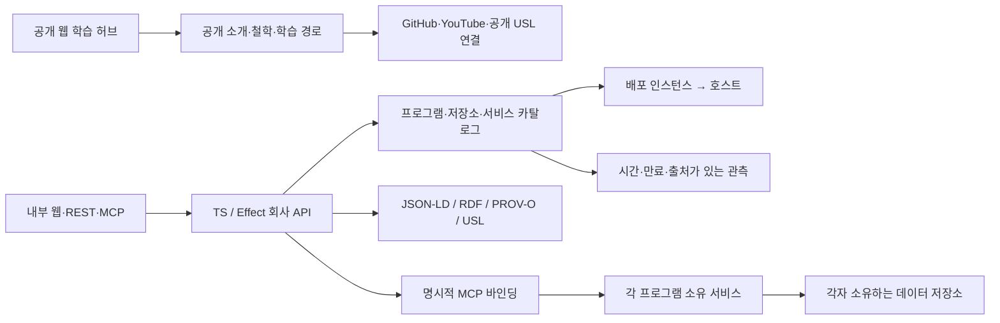

# 회사 플랫폼의 수용 범위와 기술 결정

2026-09-27. 메타휴모토닉 웹백의 우선 역할은 **회사 웹사이트를 지원하는 백엔드**다.
[웹사이트 중심 역할](WEB_BACKEND_ROLE.md)을 바탕으로, 여기서는 추가 기능인 회사
프로그램 탐색·의미 관계·소유 서비스 연결을 설명한다. 공개 웹에서는 철학·제품·GitHub·YouTube를 배우고,
내부에서는 같은 회사의 프로그램·저장소·MCP·데이터 서비스·실제 배포를 추적한다.

이 문서의 “구현”은 현재 작업 트리의 배포 후보를 뜻한다. VM100의 기존 Python
운영본과 CT308의 이전 TS 운영본은 [환경 조사](WORKSPACE_KG_AUDIT_2026-09-27.md)에
기록한 별도 배포다. 이번 확장으로 운영 트래픽을 전환하지 않았다.

## 실제로 담은 범위

[카탈로그](../ts/config/platform-catalog.json)에 197개 자산, 197개 관계,
109개 시점 관측을 등록했다. 관계와 관측에는 출처·authority·시간이 있다.

| 구분 | 수 | 범위 |
|---|---:|---|
| 프로그램 | 40 | 제품 18, 연구 8, 도구 6, 운영 4, 지식 2, 포트폴리오 2. 개발 후보도 포함 |
| 소유 저장소 | 25 | 조사한 CD 직속 저장소 21개와 중첩 독립 저장소 4개 |
| 논리 서비스 | 35 | 웹백·웹사이트·제품·운영 서비스 |
| MCP 서버 | 15 | Ontology·HSPINE·개발/데이터/운영 커넥터·메이플리니지 개발 MCP 등 |
| 데이터 서비스 | 10 | PostgreSQL 두 역할, Neo4j, Mongo, Redis, MinIO, Qdrant, Kafka, TypeDB, airo KG |
| 호스트 | 20 | Proxmox, VM/CT 13개, 별도 작업·연산 장비 6개 |
| 배포 인스턴스 | 52 | VM100/VM200의 조사된 Docker 39개와 systemd/Kubernetes 배포 |

버엑시·수풀림·메이플리니지·USL·HSWM을 유지하고 GAME의 13개 게임,
TTEST Coin/EVM, Orca 작업환경, ChatGPT Web Relay, 형식화·스킬 저장소 등을 추가했다.
`BITCOIN` 포트폴리오와 `Crypto KG Studio`는 독립 소유 Git 저장소를 확인하지 못해
미지정으로 남겼다. 다른 프로그램의 `ownerRepositoryId`는 소스 또는 운영 설정의
저장소 소유권이며 담당자·팀을 추정한 값이 아니다. 외부 참고용 clone은 회사 제품에서 제외했다.

카탈로그는 조사 범위의 목록이다. 세계의 모든 서버나 KG 전체를 열거했다는 뜻은 아니다.
프로그램 개수는 운영 중인 제품 개수가 아니며 `lifecycle`, 관계 `status`, 관측 `outcome`은
각기 다른 축이다.

## 데이터 모델과 접근



정체성은 `program → repository`, 실제 운영 위치는
`deployment → service / mcp-server / datastore`와 `deployment → host`로 표현한다.
프로그램 하나가 여러 서비스와 배포를 가질 수 있다. Python 운영 복제본 두 개와
별도 TS 실행본을 같은 “백엔드가 정상”이라는 값으로 합치지 않는다.

관측은 `process`, `container-health`, `readiness`, `http`, `backup`으로 구분한다.
조회 시 Effect Clock의 현재 시간을 순수 함수에 전달해 `fresh / stale / not-yet-observed`를
계산한다. HTTP 200이더라도 응답 본문이 degraded이면 readiness는 `degraded`로 기록한다.

현재 109개 관측은 06:17 UTC에 조립한 조사 파일을 수입한 **일회성 snapshot**이다.
해당 파일 조립 시간을 보수적인 수입 기준으로 사용했고 원래 probe 시각은 출처에 남아 있다.
15분 TTL이 지났으므로 현재 조회에서는 `stale`이다. 후속 구현으로
[PostgreSQL 관측 저장·수집 API](PLATFORM_POSTGRES.md)를 추가했다. 기본값은 여전히
snapshot 모드이며 자동 probe 수집기는 아직 구현하지 않았다.

| 인터페이스 | 사용 |
|---|---|
| `GET /api/platform/v1/inventory?q=버엑시&kind=program` | 한국어·영문 별칭과 설명 검색 |
| `GET /api/platform/v1/inventory?owner=repository:game&category=product` | 소유 저장소·분류 교차 조회 |
| `GET /api/platform/v1/inventory?lifecycle=active&integration=native` | 활성 자산과 실제 통합 수준을 교차 조회; 후보·과거·카탈로그 전용 자산은 별도 값으로 구분 |
| `GET /api/platform/v1/inventory/:id` | 자산과 점검 종류별 최신 관측 |
| `GET /api/platform/v1/summary` | 종류·분류·신선도 집계와 소유권/관측 누락 |
| `GET /api/platform/v1/graph/jsonld` | `application/ld+json`, 내부 RDF dataset |
| `GET /api/platform/v1/graph/export` | USL `property-graph/v2` 입력 |
| MCP `platform_inventory`, `platform_summary`, `platform_export` | REST와 같은 도메인 투영 |

목록은 `limit=1..100`, 기본 25, `offset=0..2000`과 `nextOffset`을 사용한다.
응답의 `digest`는 페이지 간 투영 변경 확인, `definitionDigest`는 고정된 정의 버전,
`source`는 snapshot/PostgreSQL 구분에 쓰고 `evaluatedAt`은 신선도 계산 시점이다.
내부 API는 기존 플랫폼 키와 `private, no-store` 경계를 따른다.

공개 [학습 허브](LEARNING_HUB.md)는 별도 공개 원본 51개 노드·79개 관계·6개 학습 경로를
계속 사용한다. 내부 배포·장비·관측을 공개 웹에 자동 게시하지 않는다. 새 프로그램을 공개할
때는 소개, 공식 GitHub·YouTube, 철학과의 관계를 공개 원본에 추가하고 publication digest를 검증한다.

## 채택한 기술

| 기술 | 결정과 현재 상태 |
|---|---|
| TypeScript + Effect 3 | **구현.** 순수한 도메인 함수, Schema 입력 계약, typed error, scoped Layer로 I/O 경계 유지. 이번 작업에 메이저 버전 전환을 섞지 않음 |
| JSON-LD 1.1 + RDF + PROV-O | **구현.** inline context, 범위가 있는 안정 ID, 원본 KG UID, 관계 상태·방향·출처 보존 |
| SHACL | **구현.** 자산 소유권·배포·관계·관측 제약을 별도 Python RDF 파서로 검사. CI에 잠금 파일 기반 검사 추가 |
| USL | **구현.** 소유 저장소의 실제 `property-graph/v2` 어댑터로 197개 노드/197개 관계 변환 검증 |
| MCP Streamable HTTP | **구현.** 공통 조회 도구와 고정 upstream 허용 목록. 서버 등록과 실제 연결·실행 권한을 분리 |
| PostgreSQL / Neo4j / Mongo / Redis | **기존 역할 유지·회사 PG 저장소 구현.** Wiki 원장 / KG / 피드백·MCP 레지스트리 / 요청 제한. Git 자산 정의의 버전 수입·관측 이력용 독립 PostgreSQL 어댑터 추가 |

JSON-LD는 이름 붙은 RDF graph로 내보낸다. 모든 관계는 `rdf:Statement`로 기술하고
`ACTIVE/PROPOSED/RETIRED/UNSPECIFIED`를 보존한다. 제안 관계가 자동으로 참인 RDF
triple이 되지 않으며 KG 쓰기나 USL 실행 허가도 생기지 않는다. PROV-O는 출처를
표현하고 회사 고유 타입은 별도 vocabulary에 둔다. GEIP D1–D4 적합성은 주장하지 않는다.

설계 근거: [Effect Schema](https://effect.website/docs/v3/schema/introduction),
[W3C JSON-LD 1.1](https://www.w3.org/TR/json-ld11/),
[W3C PROV-O](https://www.w3.org/TR/prov-o/), [W3C SHACL](https://www.w3.org/TR/shacl/).

## 다음 도입 순서

1. **PostgreSQL 회사 자산·관측 저장소 — 코드·실DB 검증 완료, 운영 활성화 대기.** 기존 운영 PostgreSQL에 독립 DB/role/migration을
   둔다. 정체성·종류·소유권·시간은 typed column, 원본 receipt와 확장 속성은 JSONB로
   보존한다. 버전 관리 정의와 수집 관측을 다른 테이블로 분리하고 원본 digest·수집 시각·
   만료 시각·출처 ID를 저장한다. 관측은 append-only, 출처 receipt ID는 unique로 두어
   재수집을 멱등 처리한다. 기존 Wiki·게임·LakatoTree DB를 직접 수정하지 않는다.
   완료 조건은 migration, 다른 연결에서 readback, 동시 수입·중복·재시작·장애 검사다.
   [저장소와 수집 API](PLATFORM_POSTGRES.md)는 구현했고 임시 PostgreSQL 통합 테스트 10개를
   통과했다. 운영 설정과 자동 probe 수집기는 후속 작업이다.
2. **소유 서비스별 수집 어댑터와 실제 연결.** 먼저 PostgreSQL 저장 포트에 고정된 읽기
   probe를 붙인다. timeout·동시성·출처를 제한하고 실패도 관측으로 남긴다. Ontology/HSPINE의
   기존 실제 읽기 검증을 유지하고 메이플리니지 등은 소유 계약에 맞춰 개별 검증한다.
   GitHub/YouTube 갱신도 공개 소개 수집으로 범위를 좁힌다. 제품 데이터나 임의 URL 실행을
   허용하는 범용 수집기로 만들지 않는다.
3. **OpenTelemetry 관측.** REST → 회사 MCP → upstream 요청에 trace를 연결하고 OTLP
   Collector를 기존 관측 인프라에 연결한다. service/release/asset ID로 검색하고 토큰·
   쿠키·개인정보 본문은 수집하지 않는다. 현재 `/metrics` 요청 카운터에서 확장할 단계이며
   OTel SDK와 Collector 설정은 아직 추가하지 않았다.
4. **사용자 로그인과 MCP 표준 인증.** 내부 키 운영을 유지하면서 실제 사용자·서비스
   역할을 정한 뒤 OIDC와 MCP OAuth 보호 리소스 메타데이터를 도입한다. MCP 도구별
   읽기·쓰기 범위를 token audience/scope와 연결한다. 현재 API key 인증을 OAuth 구현으로
   설명하지 않는다. IdP 제품 선정과 운영 설정은 후속 작업이다.
5. **필요가 확인된 비동기 처리.** 수집 작업에 유실 없는 전달이 필요하면 PostgreSQL
   outbox와 CloudEvents 봉투를 적용한다. 다중 소비자 fan-out에는 기존 Kafka,
   장시간 작업의 재개·보상이 필요할 때는 기존 Temporal을 검토한다. 단순 조회 API는
   현재의 요청 처리 구조를 유지한다.

PostgreSQL의 [JSONB](https://www.postgresql.org/docs/18/datatype-json.html)와
[전문 검색](https://www.postgresql.org/docs/18/textsearch.html)은 다음 저장·검색 후보다.
한국어·별칭·부분 검색은 회사의 실제 질의 묶음으로 품질을 측정한다. Qdrant는 접근 범위와
평가 자료가 준비된 의미 검색에 사용하고 현재 자산 조회의 필수 의존성으로 추가하지 않는다.
자산 모델은 [Backstage의 component/API/resource/system 구분](https://backstage.io/docs/features/software-catalog/system-model/)을
참고하되 현재 웹 허브에 필요한 API를 먼저 제공한다.

관측·인증·이벤트의 기술 근거:
[OpenTelemetry JavaScript](https://opentelemetry.io/docs/languages/js/),
[OTel Collector](https://opentelemetry.io/docs/collector/),
[MCP Authorization](https://modelcontextprotocol.io/specification/2025-11-25/basic/authorization),
[CloudEvents](https://cloudevents.io/).

## 검증과 다음 완료 조건

- 조사 증거에서 CD 직속 저장소 21개, VM/CT 13개, Docker 인스턴스 39개가 빠짐없이
  등록됐는지 검증한다. 2개 프로그램의 저장소 소유권 미정은 summary에 노출한다.
- TS 테스트는 인증·페이지네이션·검색·관측 만료·배포 참조 무결성·REST/MCP 결과 일치를
  검사한다. 실제 compiled 서버 smoke도 새 endpoint를 검사한다.
- 별도 RDFLib/pySHACL 검사는 실제 named graph의 7,162 triples를 읽고 관계 상태와
  원본 ID를 대조한다. 만료 시각과 관계 상태를 제거한 두 변형은 실패해야 한다.
- [이번 구현 검증 기록](evidence/company-inventory-2026-09-27.json)과
  [USL 변환 기록](evidence/usl-company-inventory-2026-09-27.json)을 보존한다.
- 다음 운영 단계는 PostgreSQL 관측 저장과 자동 수집의 실증, 실제 endpoint별 권한 검증,
  컨테이너 통합 게이트, 정해진 revision의 배포·readback이다. 현재 스냅샷 검증과 구분한다.

```sh
bash ts/scripts/with-node.sh npm --prefix ts run build
bash ts/scripts/with-node.sh node ts/scripts/export-platform.mjs /tmp/new-platform.jsonld
uv run --locked --script scripts/verify-platform-rdf.py /tmp/new-platform.jsonld
bash ts/scripts/with-node.sh node ts/scripts/check-usl-interop.mjs /path/to/USL
```
