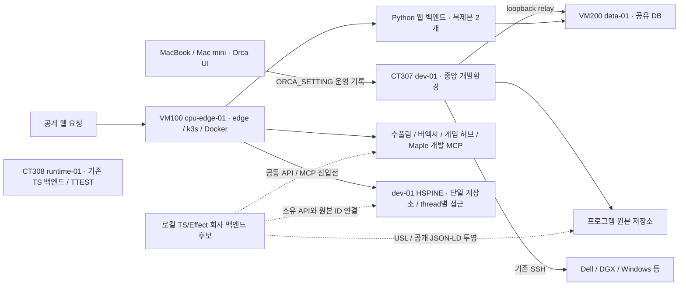

# KG·작업환경 전체 점검 — 2026-09-27

회사의 개발 자산과 운영 서비스는 현재 회사 백엔드 카탈로그보다 넓다. 기존
카탈로그의 **15개 프로그램은 전체 회사 목록이 아니다.** 코드·KG·실행 서버의
소유권과 현재 상태를 연결하는 작업이 먼저 필요하다.

이번 점검은 프로그램·인프라 중심의 읽기 조사다. 운영 배포, 서비스 재시작,
DB 데이터 변경, KG 쓰기, 다른 저장소의 수정·정리·커밋은 하지 않았다.
관측 시각은 아래 증거 파일에 UTC로 기록했다. 문서의 운영 상태는 그 시점의
관측이며 이후 상태를 보증하지 않는다.

## 확인 범위와 근거

- `/home/lagyeongjun/CD` 및 Development·SKILLS_MCP·orca·galtab 디렉터리를
  최대 4단계 내려가 조사했다. Git 작업트리 경로 **44개**, CD 바로 아래 저장소
  **21개**를 발견했다. 외부 참고 clone과 과거 구현도 포함하므로 44개를 제품 수로
  세지 않는다. archive·캐시·의존성·별도 worktree 보관 영역은 재귀 조사에서 제외했다.
- KG는 이름 검색 **33회**, 정확한 UID 상세 조회 **17회**, 1-hop 이웃 조회
  **5회**를 수행했다. 검색은 10–20행, 이웃은 50행으로 제한된다. 전체 KG 덤프나
  모든 관계의 전수 검사는 아니다. 특히 USL 이웃은 50행 상한에 도달했다.
- Proxmox의 VM/CT **13개**와 VM100·VM200 컨테이너, VM100 Kubernetes Pod,
  CT308 서비스, dev-01 서비스·포트·용량을 실제 조회했다.
- 기존 SSH 별칭 6개에서 `hostname`만 확인했다. 공개 웹·게임·HSPINE과 내부
  health/readiness는 GET으로 조사했다. 브라우저 플레이나 쓰기 기능 시험은 하지 않았다.
- Git ahead/behind는 로컬 tracking ref 기준이며 `fetch`나 원격 최신성 검증은 하지 않았다.

증거: [저장소 inventory](evidence/workspace-inventory-2026-09-27.json),
[KG 조회](evidence/workspace-kg-survey-2026-09-27.json),
[서버·HTTP·설정 관측](evidence/workspace-runtime-survey-2026-09-27.json).
세 파일은 내부 작업 문서이며 공개 학습 허브에 자동 게시하지 않는다.

## 지금의 개발·운영 구조

실선은 이번 실제 관측 또는 소유 운영 문서로 확인한 연결이다. 점선은 아직 배포하지
않은 회사 통합 백엔드의 역할이다. 이것은 구조 설명이며 실행 권한이나 배포 승인이 아니다.

Orca 중앙은 Dell이 아니라 **CT307 dev-01**이다. 이 호스트에서
`orca-serve.service`가 실행 중이다. 두 Mac의 공유 세션과 최근 네트워크 복구는
`ORCA_SETTING/STATUS.md`의 소유 기록으로 확인했다. 이번에는 Mac mini SSH를
재확인했으며 MacBook UI·세션을 다시 검사하지는 않았다.

## 프로그램·저장소 지도

아래 역할은 README·소유 문서와 manifest를 대조한 요약이다. 카탈로그에 있다는
것은 회사 백엔드가 이미 해당 제품의 모든 API를 연결했다는 뜻이 아니다.

| 원본 / 프로그램 | 실제 역할·구현 | 현재 회사 카탈로그 |
|---|---|---|
| `metahumotonic_web_back` | TS/Effect 회사 진입점 후보와 기존 Python Wiki·KG 도메인 | 등록 |
| `metahumotonic-web` | Astro 공개 사이트·책·Wiki·새 학습 허브 소스 | 등록 |
| `virtual-excel-simulator` / 버엑시 | 독립 게임; 실행 루트 `GAMES/the-excel-tycoon` | 등록 |
| `soopoolim` / 수풀림 | TS/Effect 공개 근거 그래프·방송 커뮤니티 | 등록 |
| `MAPLELINEAGE` / 메이플리니지 | 게임 백엔드·PostgreSQL 개발 구성·개발 자료 MCP | 등록 |
| `HSWM` | 토큰 기반 하이퍼그래프 월드모델 연구·런타임, Python 프로젝트 | 등록 |
| `USL` | TS/Effect 의미 연결 문법·라이브러리·SDK·CLI·MCP·Lean 연동 | 등록 |
| `HSPINE` | TS/Effect 인간 의지·수정·철회 기록; 단일 SQLite 저장소 | 등록 |
| `ICE_ORCA_DRAGON` | TS/Effect 제어 계층 + Python 물리·수학 계산 | 등록 |
| `333` | Rust P2P OS·단일 소유자 자산 이전·별도 substrate 계보 | 등록, 설명 보완 필요 |
| `MIND` | 사용자 창작·철학 원문과 Lean 형식화; AI 해석본은 별도 | 등록, 일반 제품 설명은 부정확 |
| `SYMPOSIUM` | 신화·공학 자료집, 논문·연구·Graph Engineering·스킬 | Graph Engineering으로 등록, 저장소 전체 역할보다 좁음 |
| `bhgman_tool` | KG 기반 에이전트·Longinus·스킬 도구, Python/Lean | 등록 |
| `agent-coding-paradigm` | Functional/Logic/Reactive/Harness 연구; TS/Effect 통합은 제안 단계 | 등록 |
| `chatgpt-connector` | KG·데이터·운영·개발·관리 MCP의 소유 저장소 | 등록 |
| `chatgpt-api` | 별도 웹 relay·research client·OpenClaw 연동 | **미등록** |
| `GAME` | 게임 원문·아이디어·공개 게임 허브·통합·배포 관리 | **미등록** |
| `ORCA_SETTING` | 중앙 Orca·클라이언트 연결·개발환경 운영 기록 | **미등록** |
| `SERVER` | 인프라·운영·KG 자료의 별도 저장소, 과거 기록 다수 | **미등록** |
| `spacegirl_tool` | SSB 가역 변환 도구; 효능 주장은 별도 검증 대상 | **미등록** |
| `19` | 꼴림학 연구·GraphSpec·생성/연구 자료; 로컬 원본, GitHub 없음 | **미등록**, 공개 범위 별도 |

CD 최상위의 위 21개 외에도 다음 자산이 있다.

- `BITCOIN`: 암호화폐 온톨로지·RDF/SHACL/SPARQL `kg-studio`, 독립 Git 저장소
  `ttest-coin`과 `ttest-evm`. CT308에서 `ttest-arena.service`와
  `ttest-chain.service`가 실제 실행 중이다. 회사 카탈로그에는 없다.
- `MIND/lean_formalization`: 별도 Git 저장소다. 철학 원문, 형식화, AI 해석을
  같은 출처나 권위로 합치면 안 된다.
- `SYMPOSIUM/SKILLS`: 스킬 저장소. `SYMPOSIUM/GIT`에는 HSWM·HSPINE 등의
  과거 구현, 연구 clone과 외부 비교 대상이 섞여 있다. 현재 독립 루트의 대체물이 아니다.
- Temporal과 Phoenix가 dev-01에서 실행 중이다. 현재 회사 프로그램 카탈로그에는
  해당 실행 서비스가 따로 모델링돼 있지 않다.

### 게임은 세 개보다 많다

`GAME/GAMES/INDEX.md`의 사용자 게임 정전 목록은 **11개**다. 메이플리니지,
버엑시 외에 몽환의 숲, 신인합일, HYPER CUBE, exec LOVE, 덱 기반 카드 RTS,
롤링 탕후루, 인류 탄생 헤게모니, 양자역학 퍼즐, LLM 게임 랭킹 비트코인이 있다.
아이디어 단계와 구현·운영 단계를 구분해야 한다.

공개 허브의 **6개 게임**은 다른 집합이다: NULL DRIFT, AXIS SHIFT,
ORBIT FOUNDRY, BLACK SUN SHEPHERD, ROLLING TANGHULU, HYPER CUBE.
이번에 `/game/`와 여섯 개 개별 페이지의 HTTP 200을 확인했다. 플레이 가능성·
게임 저장 기능 전체를 시험한 것은 아니다. 수풀림은 이 게임 목록과 별도 제품이다.

## 서버·DB·MCP의 실제 관측

### Proxmox

| VM/CT | 이름 | 이번 관측 |
|---|---|---|
| VM100 | cpu-edge-01 | running; 공개 edge·k3s·웹/제품 Docker |
| VM200 | data-01 | running; 공유 DB·오브젝트 저장·기타 서비스 |
| CT300 | codekg-01 | running; 내부 앱 기능은 미검사 |
| CT301 | lakatotree-01 | running; writer 정상화의 증거는 아님 |
| CT302 | openobserve-01 | running; 내부 앱 기능은 미검사 |
| CT303 | ci-runner-01 | running; 실제 CI job은 실행하지 않음 |
| CT304 | grafana-mcp-01 | running; 도구 호출은 미검사 |
| CT305 | linkedin-ops-01 | running; 내부 앱 기능은 미검사 |
| CT306 | graph-validator-01 | running; 검증 job은 실행하지 않음 |
| CT307 | dev-01 | running; 이번 작업 호스트·중앙 Orca·MCP·HSPINE |
| CT308 | runtime-01 | running; 이전 TS 백엔드와 TTEST 서비스 |
| VM309 | inspect-eval-01 | running; 평가 job은 실행하지 않음 |
| CT310 | desk-01 | running; 내부 앱 기능은 미검사 |

기존 SSH로 Dell, Mac mini, DGX, Windows `metahumo`, airo의 hostname 읽기는
성공했다. `galtab`은 해당 별칭 접속이 실패했다. 장비가 꺼졌다고 단정하지 않으며
다른 경로나 인증 변경은 시도하지 않았다.

### 데이터 저장소

KG의 `sym:Concept:data-services-location-canon`과 실제 VM200 상태가 다음
공유 저장소 목록에서 일치했다.

| 저장소 | VM200 관측 | 이번 확인 수준 |
|---|---|---|
| 정본 Neo4j | `canonical-neo4j` running / healthy | ontology MCP 실제 조회, HTTP 200 |
| airo KG Neo4j | `airo-kg` running | 컨테이너 상태 |
| PostgreSQL | `postgresql` running / healthy | 운영 Wiki 양쪽 replica의 `wiki_store_live=true`도 확인 |
| LakatoTree PostgreSQL 17 | `postgresql-lakatos` running / healthy | DB 컨테이너 상태; writer 기능과 구분 |
| MongoDB | `mongodb` running / healthy | 컨테이너 상태 |
| Redis | `redis` running / healthy | 운영 Wiki의 `wiki_rate_limit_live=true`도 확인 |
| MinIO | `minio` running | `/minio/health/live` 200 |
| Qdrant | `qdrant` running | `/healthz` 200 |
| Kafka | `kafka` running | 컨테이너 상태 |
| TypeDB | `typedb` running | 컨테이너 상태 |

PostgreSQL은 실제 운영 중이다. 이번에는 운영 SQL을 실행하지 않았다. 앞선
임시 PostgreSQL 테스트와 이번 운영 컨테이너·Wiki readiness 관측은 별개의 근거다.

KG의 “모든 상태 저장소는 VM200”이라는 문장은 공유 DB 배치를 설명하는 데는
유용하지만 회사의 모든 앱 상태까지 표현하지 못한다. HSPINE은 dev-01의 소유
SQLite 저장소를 쓰고 Orca 세션도 실행 호스트에 있다. 제품별 SQLite·논리 DB·
계정·migration 소유권을 별도로 기록해야 한다.

### 웹 백엔드와 제품 배포

- **VM100 운영 백엔드:** `web-back-pve-1/2` 모두 `uvicorn`, 동일 image
  `sha256:04012e6a5e41a212c874e6c2188ec8bc8d4d14c639d89d34768f7349a3864c7a`,
  revision label `b96487f3ba0c50d20fc9f7b30e12bc28b53423ec`였다.
  양쪽 `/health`·`/ready` 200, KG·Wiki·Wiki store·제한 저장소 live,
  `degraded=false`. 이것은 **Python 운영본**이다.
- **CT308 기존 TS 운영본:** `/srv/mhb/releases/004e37d-d8cb837ae459c233`을
  가리키며 `mhb-ts.service` active다. `/ready` 200이지만 `kg_live=false`,
  `wiki_live=false`, `degraded=true`였다. HTTP 200만 보고 완전 준비로 판정하면 안 된다.
  이 release에는 새 hub/program API가 없었다.
- **이번에 개발한 회사 백엔드와 학습 허브:** 로컬 변경이다. 공개
  `/api/public/v1/hub`와 `/learn/publication.json`은 404였다. 기존 공개
  `/health` 404는 의도된 비공개 경계이므로 장애로 세지 않는다.
- **기존 제품:** VM100의 `virtual-excel`, `soopoolim`, `supullim-app`,
  `supullim-proxy`, `maplelineage-dev-mcp`가 running / healthy였다.
  `soopoolim.metahumotonic.com`의 HTML도 200이다. 현재 로컬 수정 전체가
  그 컨테이너에 반영됐다는 주장은 하지 않는다. 메이플리니지 **개발 자료 MCP**의
  가동은 플레이어 대상 게임 서버 배포와 다르다.

### MCP와 HSPINE

dev-01에서 ontology, data, ChatGPT KG/connector/ops/development/admin MCP
서비스가 실행 중이다. VM100에도 FS·hub·LakatoTree·Neo4j 읽기 MCP와 Maple
개발 MCP의 별도 컨테이너가 있다. 새 회사 백엔드 허용 목록은 현재 ontology,
HSPINE capabilities, Maple 개발 도구 세 종류의 연결만 선언한다. 전체 MCP
환경을 이미 통합했다고 할 수 없다.

HSPINE은 실제 HTTP 조회에서 다음 두 경계를 보였다. revision은 둘 다
`c96c8dcd599c7fe4d611805455bd8d88a0a65e72`이고 저장소는 `single`이다.

- 공개 `/hspine/api/capabilities`: `mode=unified`, `execution_enabled=false`,
  thread별 접근. 공개 주소에서도 200과 같은 내용 hash를 확인했다.
- 로컬 operator `127.0.0.1:5510/api/capabilities`: `mode=local_operator`,
  `execution_enabled=true`, `kg_enabled=true`.

같은 저장소를 사용해도 공개 채널에 operator 권한을 이어주면 안 된다.
KG의 2026-09-08 connector v2 설명은 당시 구성을 담고 있어 이 9/14 이후
단일 프로그램 구조와 현재 별도 소유 저장소를 충분히 반영하지 못한다.

두 로컬 Codex 설정의 MCP 이름·활성 상태는 ontology, openaiDeveloperDocs,
context7, deepwiki, hspine, blender로 일치했다. 이 목록은 설정 확인이며 여섯
서버의 모든 도구를 이번에 시험했다는 뜻은 아니다.

## 확인한 불일치와 후속 우선순위

1. **카탈로그 범위가 좁다.** 위의 6개 CD 최상위 저장소, BITCOIN/TTEST,
   공개 게임과 운영 서비스가 빠져 있다. 먼저 제품·연구·도구·운영·참고 clone을
   구분해 식별해야 한다. 공개 사이트에 내부 연구나 운영 경로를 자동 노출하지 않는다.
2. **KG 정의와 구현 시점이 다르다.** `sym:Concept:usl`은 9/7의 개발 예정·
   구현 없음 설명을 보존하지만, 현행 소유 저장소에는 9/14 결정과 9/22 구현이 있다.
   사용자 원문은 보존하고 별도의 구현 관측·판본 관계로 갱신하는 것이 맞다.
3. **이름 검색만으로 전부 발견할 수 없다.** `runtime-01`, `ORCA_SETTING`,
   `chatgpt-api` 검색은 이번 표면에서 0행이었다. 실제 자산·저장소는 존재한다.
   ORCA_SETTING에는 r8의 KG 게시/readback 기록도 있다. 따라서 “KG에 없음”이 아니라
   현재 검색 표면에서 찾지 못한 상태다. 별칭·owner UID·projection 위치를 연결해야 한다.
4. **KG 관계 상태가 혼재한다.** USL의 조회된 50개 관계는 ACTIVE 33,
   RATIFIED 6, PROPOSED 9, RETIRED 2다. HSWM의 12개 관계 중 7개는
   UNSPECIFIED다. 이번 조사에서는 ACTIVE만 현행 연결로 취급했다. 나머지는 원래
   상태 그대로 남겨 현재 동작·권한·개발 완료로 자동 승격하지 않는다.
5. **운영 전환은 아직 분리돼 있다.** Python 운영본, 이전 TS runtime,
   현재 로컬 TS/Effect 후보를 세 개의 deployment로 관리해야 한다. 새 후보는
   기존 제품 API와 DB 소유 경계를 연결하는 진입점이며 각 프로그램을 한 DB나
   한 언어로 합치는 작업이 아니다.
6. **운영 확인이 필요한 두 항목이 있다.** `connector-estate-watch`는 06:09와
   06:14 UTC 관측에서 최신 `control` 복구 묶음의 offsite 불일치 때문에 실패했다.
   나머지 health 항목은 해당 수집기에서 통과했다. 백업 전체 소실이나 복원 불능으로
   확대 해석하지 않는다. VM100의 별도 `infra/homepage` Pod는
   `CrashLoopBackOff`, Ready=false, 누적 restart 2015였다. 공개 회사 사이트와
   같은 서비스로 단정하지 않는다. 원인 수리·재시작은 이번에 하지 않았다.
7. **작업 중인 상태가 많다.** CD 최상위 21개 중 11개가 dirty였다. 수풀림,
   Maple, GAME 등은 최근 커밋 날짜만으로 현재 개발 상태를 설명할 수 없다.
   기존 변경과 과거 worktree를 보존하면서 소유 루트를 기준으로 통합해야 한다.

용량 관측: dev-01 루트 파일시스템 사용률 **73%**, 약 **52 GiB** 여유.
Proxmox `local-lvm`은 **83.10%**였고 조회한 네 storage는 active였다.
이는 용량 관측이며 이번에 자산을 정리하거나 공간을 확보하지 않았다.

회사 백엔드의 다음 구현 순서는 **소유자·프로그램·배포 registry 보완 → 읽기
MCP/API 연결과 상태 관측 → 공개 가능 소개·GitHub·YouTube·학습 경로 투영 →
검증한 TS 후보의 운영 전환**으로 잡는 것이 적절하다. 공개 학습 허브와 내부
운영 registry는 같은 안정 ID로 연결하되 공개 범위는 별도 계약으로 관리한다.

GEIP는 내부 설계 프로파일이며 외부 공인 표준 인증이 아니다. 현재 회사
control card는 G0이고, 다른 프로젝트의 G1 선언이나 USL 변환 통과가 회사
전체의 실행 검증 등급을 자동으로 올리지 않는다. RDF/JSON-LD/PROV 등 교환
형식과 실제 API·DB·권한·운영 검증을 각각 근거로 연결해야 한다.
